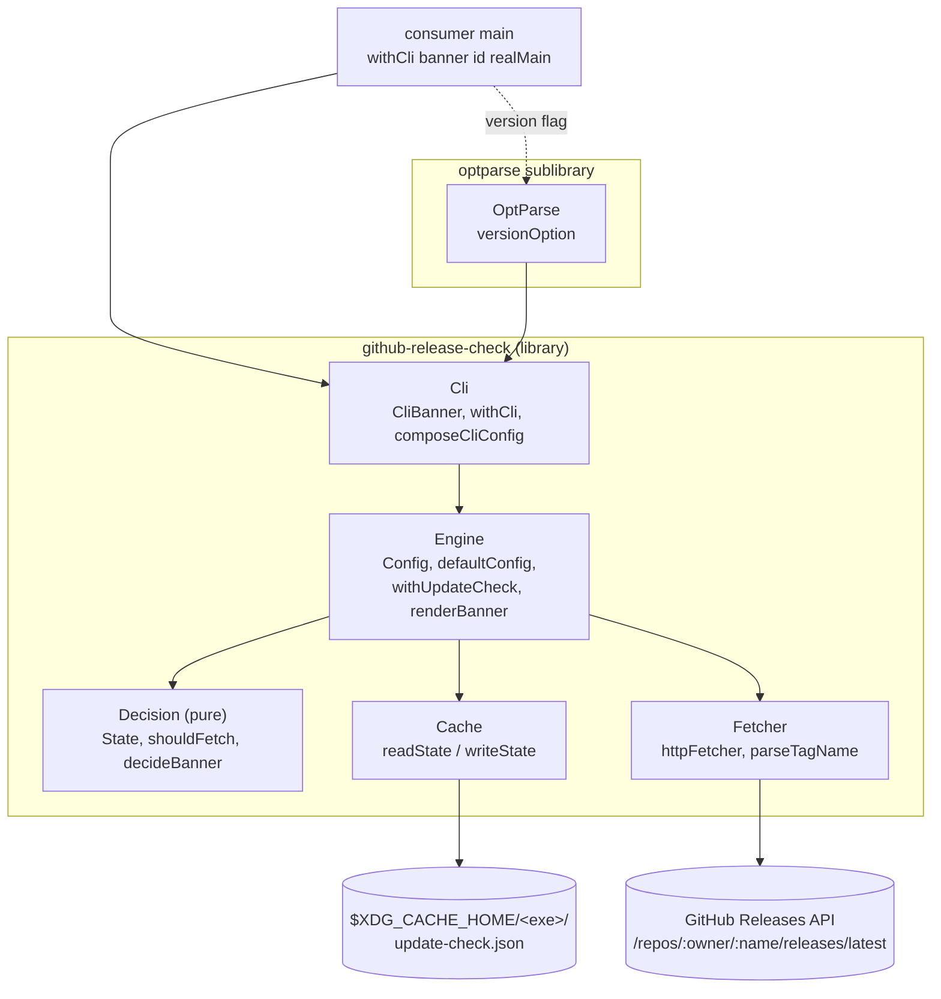
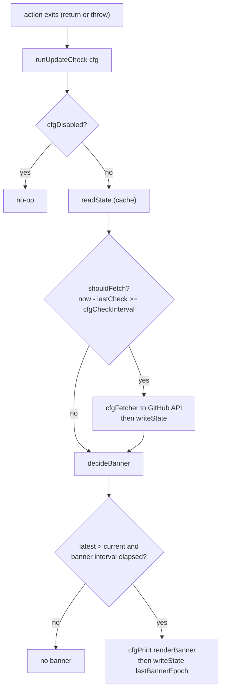

# github-release-check

A small Haskell library that prints an _update banner_ on stderr when a
CLI is behind its latest GitHub release.

## What is this

`github-release-check` wires a polite "a newer version is available"
reminder into a Haskell CLI's `main`. It is built for small, on-prem
tools where:

- the executable is published to GitHub Releases under a `v<semver>`
  tag,
- users install via Homebrew, AppImage, DEB, or `cabal install`, and
- you want a rate-limited nudge toward the latest release — without
  forcing an opinionated auto-updater on anyone.

The check runs **after** the wrapped action finishes (or throws). It is
designed to be invisible when it has nothing to say and harmless when it
fails:

- it is rate-limited by an on-disk JSON cache with two independent
  timers — one throttles GitHub API hits, the other throttles banner
  prints;
- it is **silent on every failure** — a network error, non-200
  response, parse error, or timeout collapses to "do nothing";
- it **never throws** and never changes the wrapped action's exit code;
- it is opt-out friendly — a caller-named environment variable disables
  it entirely.

The core library depends only on `http-client`/`aeson`/`time` and
friends; the optional `--version` flag lives in a separate
`github-release-check:optparse` sublibrary so consumers that only want
the banner pay no `optparse-applicative` cost.

## Architecture

The library is a thin IO shell around a pure decision core. `Cli` is the
consumer-facing one-liner; `Engine` owns the `Config` and the on-exit
run loop; `Decision` is pure (two cache-timer gates); `Cache` and
`Fetcher` are the two IO leaves.



The runtime check, executed once on exit, is two cache-timer gates:



## Install

The library is consumed as a build dependency. It is not on Hackage; add
it to a consumer project via a `source-repository-package` stanza in the
consumer's `cabal.project`:

```cabal
source-repository-package
  type:     git
  location: https://github.com/lambdasistemi/github-release-check
  tag:      <commit-or-release-tag>
```

Then depend on it (and, optionally, the `--version` sublibrary) in the
consumer's `.cabal`:

```cabal
build-depends:
  , github-release-check
  , github-release-check:optparse   -- only if you want --version
  , optparse-applicative            -- only if you want --version
```

The repository is also a flake: `nix run .#canary` builds and runs the
in-repo canary executable (see [Development](#development)).

## Quickstart

Wrap `main` in `withCli`. The one-liner bundles env-var opt-out,
`defaultConfig`, and `withUpdateCheck` into a single call:

```haskell
import GitHub.Release.Check
import Paths_my_cli (version)

main :: IO ()
main = withCli banner id realMain

banner :: CliBanner
banner = CliBanner
    { cliRepo         = RepoSlug "lambdasistemi" "my-cli"
    , cliExe          = "my-cli"
    , cliVersion      = version
    , cliOptOutEnvVar = "MY_CLI_NO_UPDATE_CHECK"
    }
```

After `realMain` returns — or throws — the check fires:

- if the cache is older than the check interval (default 1 h), it hits
  `https://api.github.com/repos/<owner>/<name>/releases/latest` with a
  2 s timeout;
- if the latest release is greater than the configured current version
  and the banner has not printed within the banner interval
  (default 1 h), it emits a two-line banner to stderr.

The check **never throws**, never affects the wrapped action's exit
code, and silently skips on any network or parse failure.

## Usage

### Overriding `Config` fields

The `id` in `withCli banner id realMain` is the `Config -> Config`
modifier. Pass `id` when the defaults are fine. Pass something else when
they aren't:

```haskell
import qualified Data.Text.IO as T.IO

main = withCli banner
    (\cfg -> cfg { cfgCheckInterval = 24 * 3600    -- daily, not hourly
                 , cfgPrint         = T.IO.putStrLn -- banner to stdout
                 })
    realMain
```

The env-var kill switch (`MY_CLI_NO_UPDATE_CHECK` in the example above)
**takes precedence over the modifier**: setting the env var disables the
check even if the modifier sets `cfgDisabled = False`. This protects
users who opt out from a careless library upgrade.

### `--version` flag

The optional `github-release-check:optparse` sublibrary exposes a
matching `versionOption` info-flag that prints `<exe> <semver>` and
exits `0`, drawing the exe name and version from the same `CliBanner`
record. Wire it into your parser with `<**>`:

```haskell
import Options.Applicative
import GitHub.Release.Check.OptParse (versionOption)

main :: IO ()
main = do
    opts <- execParser $
        info
            (myParser <**> versionOption banner <**> helper)
            (fullDesc <> progDesc "...")
    withCli banner id (run opts)
```

`my-cli --version` now prints `my-cli <semver>` and exits `0`. The core
library does **not** depend on `optparse-applicative` — consumers that
only want `withCli` pay no transitive cost.

### Raw control

`withCli` is sugar over the lower-level entry points, which remain
exported. Use them when you need full control of the `Config` assembly:

```haskell
import GitHub.Release.Check
import Paths_my_cli (version)

main :: IO ()
main = do
    cfg <- defaultConfig
        (RepoSlug "lambdasistemi" "my-cli")
        "my-cli"
        version
    withUpdateCheck cfg realMain
```

With the raw entry points the opt-out env var is the caller's
responsibility (read it via `lookupEnv` and set `cfgDisabled` on the
`Config`). `composeCliConfig` is also exported if you want the assembled
`Config` without entering `withUpdateCheck` (e.g. to inspect it in a
test).

### `Config`

```haskell
data Config = Config
    { cfgRepo           :: RepoSlug
    , cfgExeName        :: Text
    , cfgCurrentVersion :: Version
    , cfgCachePath      :: FilePath
    , cfgCheckInterval  :: POSIXTime     -- seconds between GitHub hits
    , cfgBannerInterval :: POSIXTime     -- seconds between banner prints
    , cfgTimeoutMicros  :: Int           -- per-fetch timeout, microseconds
    , cfgPrint          :: Text -> IO () -- banner sink (default: stderr)
    , cfgFetcher        :: Fetcher       -- HTTP backend (override-able)
    , cfgDisabled       :: Bool          -- caller-resolved kill switch
    }
```

`defaultConfig` fills in the standard knobs (1 h check interval, 1 h
banner interval, 2 s timeout, cache under `$XDG_CACHE_HOME`, banner to
stderr, live HTTPS fetcher, enabled); callers tweak the fields they care
about, either via the `withCli` modifier or directly on the record.

### Opt-out

The library does not bake a default env-var name — that is the caller's
business (`cliOptOutEnvVar` in `CliBanner`). The recommended convention
is `<UPPER_SNAKE_EXE_NAME>_NO_UPDATE_CHECK`, e.g. `MY_CLI_NO_UPDATE_CHECK`.
Any value (including the empty string) is treated as "disable"; only
unsetting the variable re-enables the check.

### Cache file

Default location: `$XDG_CACHE_HOME/<exe>/update-check.json` (with the
standard XDG fallback to `~/.cache/<exe>/update-check.json`). Epoch
fields are stored as integer seconds:

```json
{
  "lastCheckEpoch": 1700000000,
  "lastKnownLatest": "0.2.10.0",
  "lastBannerEpoch": 1700000100
}
```

The three fields are independent: a failed or empty fetch does not
clobber a previously-known latest version, and printing a banner does
not bump the check timer. A missing, unreadable, or malformed file is
treated as empty state, so the cache can never fail the check it backs.

### Real-world consumer

[`cardano-tx-tools`](https://github.com/lambdasistemi/cardano-tx-tools)
depends on `github-release-check` and its `:optparse` sublibrary across
several of its executables to show the upgrade banner and wire
`--version`. The integration was carried out in
[lambdasistemi/cardano-tx-tools#27](https://github.com/lambdasistemi/cardano-tx-tools/issues/27).

## Documentation

This README is the primary reference; Haddock comments on every exported
module and value carry the per-function detail.

For AI agents, start at [AGENTS.md](AGENTS.md) — it points at the
`skills/github-release-check-guide/` skill, which maps the repository,
lists the verified build/test commands, and explains how to answer
questions about the library.

## Development

```bash
nix develop --quiet
just unit          # cabal test unit-tests -O0
just format        # fourmolu + cabal-fmt + nixfmt
just hlint         # hlint lib lib-optparse test
nix flake check    # full local CI mirror (build + unit + lint + canary)
```

`just` with no recipe lists everything; `just build` compiles the
library, sublibrary, canary, and tests with `-O0`.

### Canary

`github-release-check-canary` is a tiny executable that wires the
library against this repository, dogfooding both `withCli` and
`versionOption`. It runs in CI on every build (with the network call
disabled via its opt-out env var to keep the Nix sandbox hermetic), and
operators can invoke it live to probe the real GitHub API:

```bash
nix run .#canary
# github-release-check-canary 0.1.0.0 — library wired against lambdasistemi/github-release-check

nix run .#canary -- --version
# github-release-check-canary 0.1.0.0
```

If a newer release is available the library prints its banner to stderr
after the canary line. Setting
`GITHUB_RELEASE_CHECK_CANARY_NO_UPDATE_CHECK=1` disables the check.

## License

Apache-2.0. See [LICENSE](LICENSE).
